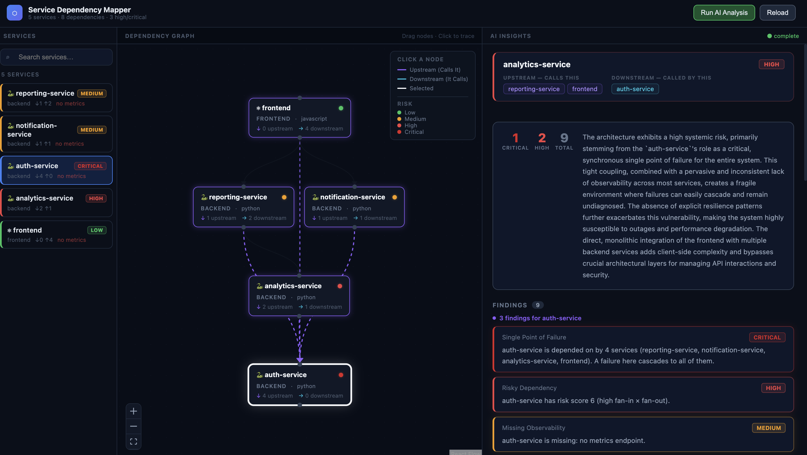

# Service Dependency Mapper

Automatically discovers and visualizes service dependencies across a microservice ecosystem, then runs AI-assisted architectural analysis to surface single points of failure, tight coupling, and observability gaps.

---

## The Problem

In a microservice organization, no one has a complete picture of who calls whom. When `auth-service` goes down, which services break? When you deploy `notification-service`, what needs to be tested? This tool answers those questions by ingesting your existing config files — no agents, no network access required.

---

## Demo

```
1. docker compose up
2. Open http://localhost:3000
3. Click "Load Sample Data"     ← seeds a 5-service mock ecosystem
4. Click "Run AI Analysis"      ← triggers the agent pipeline
5. Click any node in the graph  ← filters insights to that service
```

The sample data models a realistic ecosystem: `auth-service`, `reporting-service`, `notification-service`, `analytics-service`, and `frontend`.



---

## Architecture

```
┌─────────────────────────────────────────────────────┐
│  Browser (React + ReactFlow)                         │
│  ┌──────────────┐ ┌──────────────┐ ┌─────────────┐  │
│  │ Service List │ │  Dep. Graph  │ │  Insights   │  │
│  │  (10% width) │ │  (30% width) │ │ (60% width) │  │
│  └──────────────┘ └──────────────┘ └─────────────┘  │
└──────────────────────┬──────────────────────────────┘
                       │ REST / JSON
┌──────────────────────▼──────────────────────────────┐
│  FastAPI Backend                                     │
│                                                      │
│  ┌─────────────┐   ┌──────────────┐                 │
│  │  Discovery  │   │  Graph Svc   │                 │
│  │  - Docker   │──▶│  (NetworkX)  │                 │
│  │    Compose  │   │  - SPOF      │                 │
│  │  - OpenAPI  │   │  - Coupling  │                 │
│  │  - JSON     │   │  - Risk score│                 │
│  └─────────────┘   └──────┬───────┘                 │
│                           │                          │
│  ┌────────────────────────▼────────────────────┐    │
│  │  AI Agent (Planner / Executor / Synthesizer) │    │
│  │  1. Executor  → run deterministic tools      │    │
│  │  2. Planner   → decide if LLM is warranted   │    │
│  │  3. Synthesizer → Gemini adds narrative       │    │
│  └────────────────────────────────────────────┘     │
└─────────────────────────────────────────────────────┘
```

---

## AI Agent Design

The agent follows a **Planner → Executor → Synthesizer** pattern.

### Why this pattern?

Sending a raw graph to an LLM and asking "what's wrong?" wastes tokens and produces unreliable output — the LLM may hallucinate graph structures it can't actually see. Instead:

**Step 1 — Executor (deterministic, zero LLM cost)**
Four rule-based tools run first using NetworkX graph algorithms:

| Tool | Algorithm | What it finds |
|------|-----------|---------------|
| `find_single_points_of_failure` | in-degree threshold | Services depended on by ≥ N others |
| `find_tight_coupling` | bidirectional edge check | Services that call each other |
| `score_dependency_risk` | `fan-in × fan-out` + observability penalty | High-blast-radius nodes |
| `find_missing_observability` | metadata check | Services without metrics/logging/health |

**Step 2 — Planner (gate check)**
Decides whether LLM synthesis is worthwhile: is the graph non-trivial? Is an API key configured? If not, the system returns rule findings with human-readable fallback text — still useful without any LLM.

**Step 3 — Synthesizer (LLM adds narrative)**
Tool findings are serialized and passed to Gemini with the full graph topology. The prompt asks for architectural observations, ordered recommendations, and a risk summary in a structured format. The LLM extends what the rules already found — it never rediscovers what a graph algorithm can answer in microseconds.

**Graceful degradation:** if the Gemini API is unavailable or rate-limited, the system falls back to rule-only output automatically. No crash, no empty response.

---

## Discovery Sources

The system merges two sources for the sample data (richer combined picture than either alone):

| Source | What it extracts |
|--------|-----------------|
| **Docker Compose** | Service names, `depends_on` edges, URL references in env vars |
| **OpenAPI YAML** (`x-service-metadata`) | Language, endpoints, metrics/logging flags, typed dependency edges |
| **Raw JSON** | Direct upload of `{services, dependencies}` payload |

Both sources are merged: OpenAPI provides observability metadata; Docker Compose provides topology for services without specs (e.g. `frontend`).

Adding a new source (Kubernetes YAML, Consul catalog) requires implementing one function in `discovery.py` — no changes to routing or agent logic.

---

## Quick Start

```bash
# 1. Add your Gemini API key (AI analysis works without it, but LLM synthesis is skipped)
cp backend/.env.example backend/.env
# edit backend/.env and set GEMINI_API_KEY

# 2. Start everything
docker compose up

# 3. Open http://localhost:3000
```

---

## Tech Stack

| Technology | Why |
|------------|-----|
| **FastAPI** | Async-native, automatic OpenAPI docs, Pydantic validation out of the box |
| **NetworkX** | Graph algorithms (centrality, cycle detection) without reinventing the wheel |
| **Google Gemini** (`gemini-flash-latest`) | Fast, cheap inference; `asyncio.to_thread` wraps the blocking SDK call |
| **React + ReactFlow** | Interactive draggable graph with persistent node positions |
| **structlog** | Structured JSON logs with `request_id` bound per request via context vars |
| **pydantic-settings** | 12-factor config — all settings from env vars, no hardcoded values |

---

## Production Practices

- **Structured logging** — every request gets a full UUID `request_id`; logs are JSON for ingestion into any log aggregator
- **RFC 7807 error responses** — consistent `{type, title, detail}` shape for all errors
- **Async job pattern** — AI analysis runs as a `BackgroundTask`; client polls `GET /api/analysis/{job_id}` for the result
- **Health + metrics endpoints** — `GET /health` and `GET /api/metrics` expose graph stats and job counts for readiness probes and dashboards
- **Docker** — multi-stage frontend build (Vite → Nginx); `.dockerignore` prevents secrets from entering images
- **CI pipeline** — GitHub Actions runs the full test suite on every push

---

## Tests

Three layers, 12 tests total:

```bash
cd backend
pip install -r requirements-dev.txt
pytest tests/ -v
```

| File | What it tests | Approach |
|------|--------------|----------|
| `test_graph_service.py` | SPOF, coupling, risk algorithms | Pure logic — no mocks, no network |
| `test_planner.py` | Agent paths (rule-only, LLM, fallback) | `AsyncMock` patches Gemini |
| `test_analysis_router.py` | Full job lifecycle via HTTP | `TestClient` integration tests |

A `conftest.py` autouse fixture resets all module-level state between every test — no bleed between test cases regardless of execution order.

---

## Environment Variables

| Variable | Default | Description |
|----------|---------|-------------|
| `GEMINI_API_KEY` | *(empty)* | Gemini API key — AI synthesis skipped if not set |
| `GEMINI_MODEL` | `gemini-flash-latest` | Model to use for synthesis |
| `LOG_LEVEL` | `INFO` | `DEBUG`, `INFO`, `WARNING` |
| `SPOF_IN_DEGREE_THRESHOLD` | `2` | Minimum dependents to flag a service as a SPOF |
| `GRAPH_PERSISTENCE_PATH` | *(disabled)* | File path to persist graph JSON across restarts |

---

## API Reference

| Method | Path | Description |
|--------|------|-------------|
| POST | `/api/services/load/sample` | Load built-in 5-service demo |
| POST | `/api/services/load` | Upload custom ServiceMetadata JSON |
| GET | `/api/services` | List all discovered services |
| GET | `/api/graph` | Dependency graph (nodes + edges) |
| GET | `/api/insights/{service}` | Upstream/downstream relationships |
| POST | `/api/analysis/run` | Trigger AI analysis — returns `job_id` |
| GET | `/api/analysis/{job_id}` | Poll analysis result |
| GET | `/health` | Service health + graph stats |
| GET | `/api/metrics` | Operational metrics (job counts, risk distribution) |

Interactive docs: `http://localhost:8000/docs`

---

## Tradeoffs & Assumptions

| Decision | Tradeoff |
|----------|----------|
| **In-memory graph** | Restart wipes state. Acceptable for a demo; production would use Neo4j or SQLite via NetworkX serialization |
| **Mocked discovery** | Parses config files, not live services. The parser layer is abstracted so real sources (k8s, Consul, source code) slot in without touching routing or agent logic |
| **Single LLM call** | No streaming, no retry loop. Production needs a job queue (Celery/ARQ) for concurrent users and SSE for incremental output |
| **No authentication** | Out of scope. Production needs at minimum an API key header on all routes |
| **Sync rule tools** | `tools.run_all()` is synchronous — the tools are CPU-bound graph math completing in < 1ms, not I/O. Making them `async` without `await` would be misleading |

---

## What I'd Build Next

Ordered by production impact:

1. **Kubernetes manifest support** — parse Deployments, Services, and Ingresses to infer topology directly from cluster state; more reliable than config files and covers the majority of real production environments
2. **Streaming AI analysis** — Server-Sent Events so insights appear incrementally rather than after a full round-trip
3. **Graph snapshots + diff view** — persist graph versions, show "what changed" between deploys (new edges, removed services, risk delta)
4. **True multi-agent loop** — replace the single LLM synthesis call with a proper agent loop where each tool result feeds back into the model, which then decides what to investigate next
5. **Alerting hooks** — webhook/Slack notification when a deploy introduces a new SPOF or crosses a risk threshold
